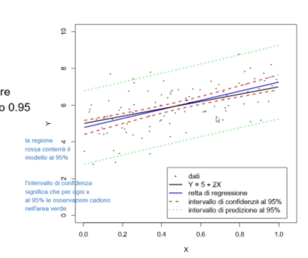

# dReal1
**R, cause as they say, rrrr, r, rrrrrrr, rr, r. And don't forget, keep on rrrrrr!**

## 🪣 List
- Perché controllano la regressione singola su tutto l'universo
Per fare i grafici

- Perché controllano la regressione multipla su tutto l'universo
bro.. tf..? were you smoking or smth? or r we now?

- Come controlliamo l'overfitting?
Lo fa lui, BIC AIC

- Come scegliamo il modello da cui partire per muoverci verso il modello finale
In maniera occhiometrica con la roba diagnostica che in realtà non capiamo (a parte qq)

- Modello che predicta y in base alle tante x, why (ig how is more important but who cares)
huh?

- 
- Potremmo fare una cosa del genere dividendo il modello finale in contributi da parte di singoli regressori
- I want you ↑

<!-- TODO: does this work? -->

### la parte di statistica descrittiva 1

#### done?
- Comment the data
- Other noticeable thinghies (hanno i baffi)
Notato che hanno i baffi, grandi baffi con pezzo ispirato ad iphone x

### la parte di statistica descrittiva 2
- choose whether to use the tables
Le usiamo, ma commentate nel rrrrrrreporrrrrrrt
- capire definizione della statistica test usata nel test di Shapiro
- De-functionize the function

#### done?
- Explain how you choose number of thinghies 🪣
- Denote clear noticeable thinghies
- Shits and giggles
- since we don't know if they're "normal" (what does that mean anyway?): Q-Q plots

