***Sounds About rrrRight***

# 0. Introduzione al Progetto
Questo progetto si svolge nel più ampio contesto del corso di Statistica Applicata nel CdL in Ingegneria Informatica all'Università di Salerno.

Ci è stato fornito un dataset rappresentativo di un campione dei quali elementi consideriamo 8 caratteristiche, una di queste è espressa come dipendente dalle altre.

L'obbiettivo di questa attività è quello di svolgere un'analisi statistica descrittiva sui dati forniti, per poi procedere con una fase di regressione lineare multipla, al fine di identificare un modello che possa spiegare al meglio la variabilità della variabile dipendente in funzione delle altre caratteristiche.

Al termine dell'attività potremo fornire a un ipotetico operatore le conoscenze necessarie per ottimizzare la procedura di acquisizioni di immagini da UAV.

# 1. Analisi Statistica Descrittiva
Nella sezione di Statistica Descrittiva andremo a utilizzare una serie di strumenti per valutare la natura dei dati forniti. Questi strumenti permettono di ottenere insight sui dati presentati, che verranno usati per guidare le fasi successive del progetto.

Il campione in analisi è costituito da 100 (`n = nrow(ds)`) elementi di cui sono definite 8 caratteristiche di natura quantitativa continua.

Per avere un'idea limitata ma immediata della natura dei dati, abbiamo visualizzato i valori iniziali e finali del campione, ordinati secondo la variabile dipendente `y_IQ`.

```R console
> head(twist_sorted)
      y_IQ      x1_ISO       x2_T       x3_MP
  85.76275  1.71051927  1.2694487 -1.60960262
  89.37733  0.47531620  1.6607291  0.01548673
  91.74121  1.61621307  1.6178761  0.94264143
  94.66445  1.43905003  1.4720261 -1.06032801
 101.76777  0.01069104  1.5602105 -1.71690096
 104.91759  1.40622836  0.6077778  0.20020511
     x4_CF        x5_F     x6_GSI       x7_UA
-0.5973638  1.21935086  0.9950725  -1.2313230
-0.3395450  2.11793190  1.5027906  -1.6492509
-1.5664503 -1.95141132  0.7572437  -0.2628265
 0.7965453  0.03008541 -0.6582414  -0.7980054
 1.2178391  0.46207915  0.7841440  -1.1420552
-0.1788123  1.62989182  0.4556526   1.4947013

> tail(twist_sorted)
      y_IQ     x1_ISO        x2_T      x3_MP 
  166.9723  0.1009377 -0.09395068  1.2803254 
  168.0356 -0.2722747  0.58255508 -0.3704142 
  172.9470 -1.7186148 -1.02359897  1.4190216 
  174.0162 -1.0760703 -1.57173461  1.4307073 
  178.1100 -1.6223626 -1.28167295  0.3701268 
  181.1781 -1.6345881 -1.50141175  0.2449209 
     x4_CF       x5_F     x6_GSI       x7_UA
-0.1025210 -0.8338555 -0.7336588 -0.19635859
-0.4599907 -0.3538943 -1.6650442  0.46473235
-1.5514532 -1.4660646 -1.4374694  0.79578587
 0.3972056 -0.9538855 -0.6366092 -0.08404836
 0.7842828 -0.8365009 -0.2303526  0.29413924
 1.3692702 -0.7514527 -1.0163686 -0.88874785
```

## 1.1. Summary & Whiskerrrrrrs
Prima di tutto valutiamo gli indici di tendenza centrale (media e mediana) e di dispersione (deviazione standard) per tutte le caratteristiche del dataset.

```R console
      y_IQ                x1_ISO                x2_T            
 Min.   :  85.76      Min.   :-1.71861     Min.   :-1.57489     
 1st Qu.: 117.65      1st Qu.:-0.60159     1st Qu.:-0.91172     
 Median : 135.13      Median : 0.08236     Median :-0.10059     
 Mean   : 134.27      Mean   : 0.06321     Mean   :-0.04587     
 3rd Qu.: 148.53      3rd Qu.: 0.90001     3rd Qu.: 0.69212     
 Max.   : 181.18      Max.   : 1.72094     Max.   : 1.66073     
     x3_MP                x4_CF                 x5_F         
 Min.   :-1.7278494   Min.   :-1.65848     Min.   :-2.1460   
 1st Qu.:-0.7305715   1st Qu.:-0.71533     1st Qu.:-0.7686   
 Median : 0.0963404   Median :-0.08772     Median :-0.1531   
 Mean   :-0.0002303   Mean   :-0.02413     Mean   : 0.0000   
 3rd Qu.: 0.7124093   3rd Qu.: 0.81905     3rd Qu.: 0.6915   
 Max.   : 1.7311851   Max.   : 1.72493     Max.   : 2.4726   
     x6_GSI             x7_UA       
 Min.   :-1.71454     Min.   :-1.6839 
 1st Qu.:-0.90640     1st Qu.:-1.0527 
 Median :-0.30275     Median :-0.1906 
 Mean   :-0.09797     Mean   :-0.1496 
 3rd Qu.: 0.78453     3rd Qu.: 0.6444 
 Max.   : 1.70911     Max.   : 1.6263 
```
*summary*

```R console
                StD        Var
y_IQ        20.3977   416.0670
x1_ISO       1.0159     1.0321
x2_T         0.9618     0.9251
x3_MP        0.9746     0.9498
x4_CF        0.9741     0.9490
x5_F         1.0000     1.0000
x6_GSI       0.9879     0.9759
x7_UA        0.9997     0.9995
```
*deviazione standard e varianza*

Notiamo che le variabili indipendenti presentano una deviazione standard prossima ad 1, ed una media prossima a 0, il che suggerisce che si possa trattare di dati standardizzati. La variabile dipendente invece è definita nel range [85.76, 181.18], per cui ne possiamo valutare il coefficiente di variazione (`sd(y_IQ) / mean(y_IQ)`), che si attesta attorno al 15%.


Queste informazioni possono essere analizzate in maniera efficace mediante l'utilizzo dei boxplot. Si sceglie di visualizzarne i notch e si tiene conto del fatto che il numero di osservazioni è uguale per tutte le variabili, per cui l'uso di `varwidth` è indifferente.


<!-- *whisker plots start appearing* -->
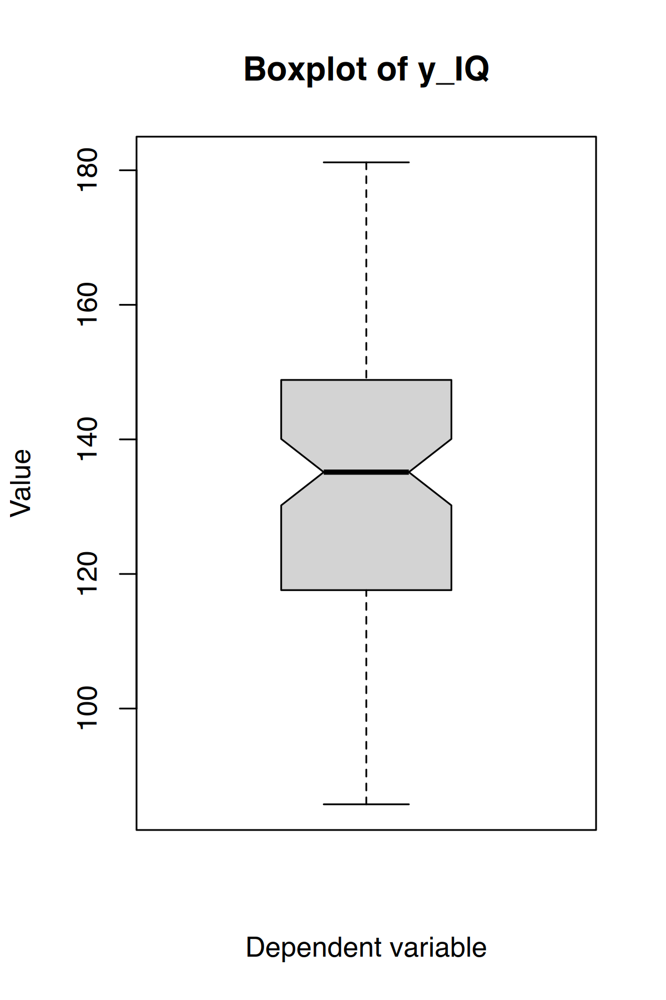{width=40%} 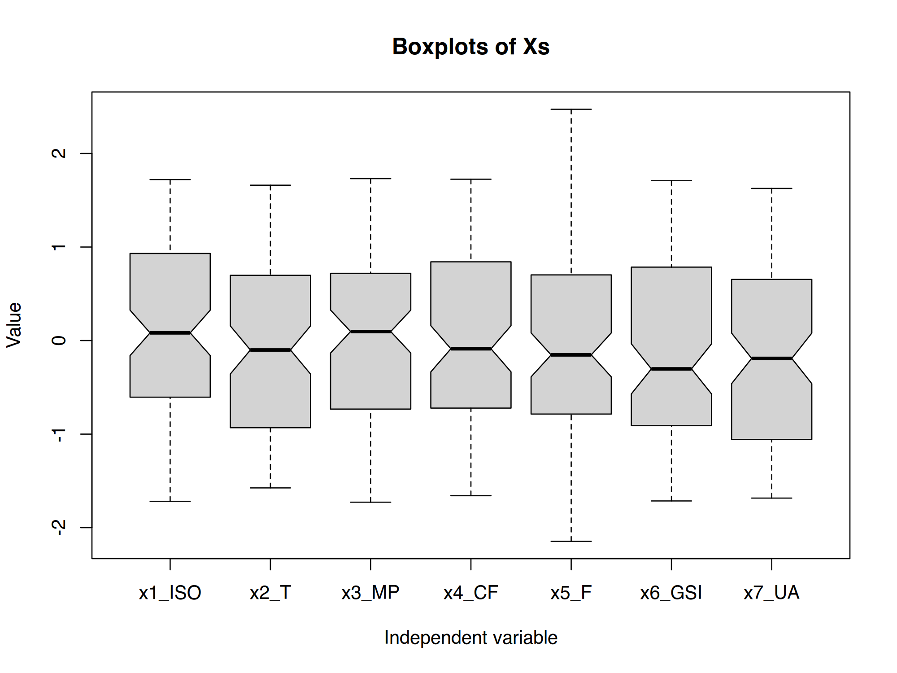

Si nota:
- l'assenza di outliers prima di Q1 - 1.5\*IQR e oltre Q3 + 1.5\*IQR per tutte le variabili considerate, con influenza sulla lunghezza dei baffi 
  - la variabile x5_F ha un'escursione campionaria particolarmente superiore alle altre, nonostante un IQR (range Q1-Q3) tra i più piccoli
- le notch di tutte le variabili indipendenti tendono a sovrapporsi, che rende possibile eventuali uguaglianze tra mediane

## 1.2. Istogrammi e Q-Q plot
Per una sintesi visiva della distribuzione di frequenza dei valori delle caratteristiche prese in considerazione si può fare uso di istogrammi.
Ricordando che l'informazione è di tipo quantitativo continuo, c'è la necessità di definire il numero di classi (k) in cui suddividere l'intervallo di osservazione.<br>
Di norma si procede con la relazione empirica di Sturges ($k = \lceil1 + 3.3 \cdot \log_{10}{n}\rceil$), o seguendo la norma UNI 4724-66 (secondo cui per una numerosità campionaria fino a 100 elementi si usano massimo 8 classi, 10 fino a 250), ma il comando `hist()` determina i confini in maniera che i confini risultino facile da leggere.

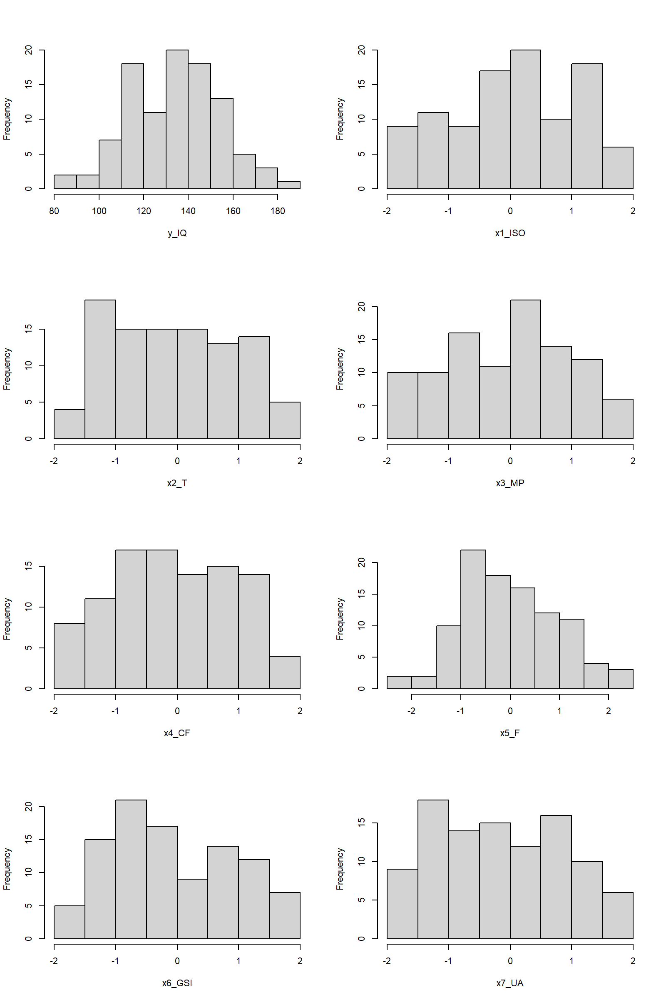

Non si notano somiglianze a distribuzioni particolari per la maggior parte delle variabili, meno che per y_IQ e x5_F, che nonostante alcuni rilevanti scostamenti, sono approssimabili a distribuzioni normali.

Per verificare ciò è possibile analizzarne i Q-Q plots, grafici che confrontano i quantili dei dati campionari con quelli della distribuzione teorica supposta (normale: `qqnorm()`).

Tale visualizzazione è accompagnata dai risultati del test d'ipotesi di Shapiro-Wilk ovvero:
$$
\begin{array}{ll}
H_0: \text{i dati provengono da} & \qquad\qquad H_A: \text{i dati non provengono da} \\
\phantom{H_0: }\text{una distribuzione normale} & \qquad\qquad \phantom{H_A: }\text{una distribuzione normale}
\end{array}
$$

Il test si effettua valutando la statistica test:
$$
0 \underset{H_A}{\le} W = \frac{\left(\sum_{i=1}^n a_i x_{(i)}\right)^2}{\sum_{i=1}^n (x_i - \bar{x})^2} \underset{H_0}{\le} 1
$$

Scegliendo un livello di confidenza 1-α = 0.95 il criterio di scelta è:
$$
p = \mathbb{P}(T_n = W < t_n = w_{\text{oss}} \mid H_0) \space \underset{H_A}{\overset{H_0}{\gtrless}} \space \alpha = 0.05
$$

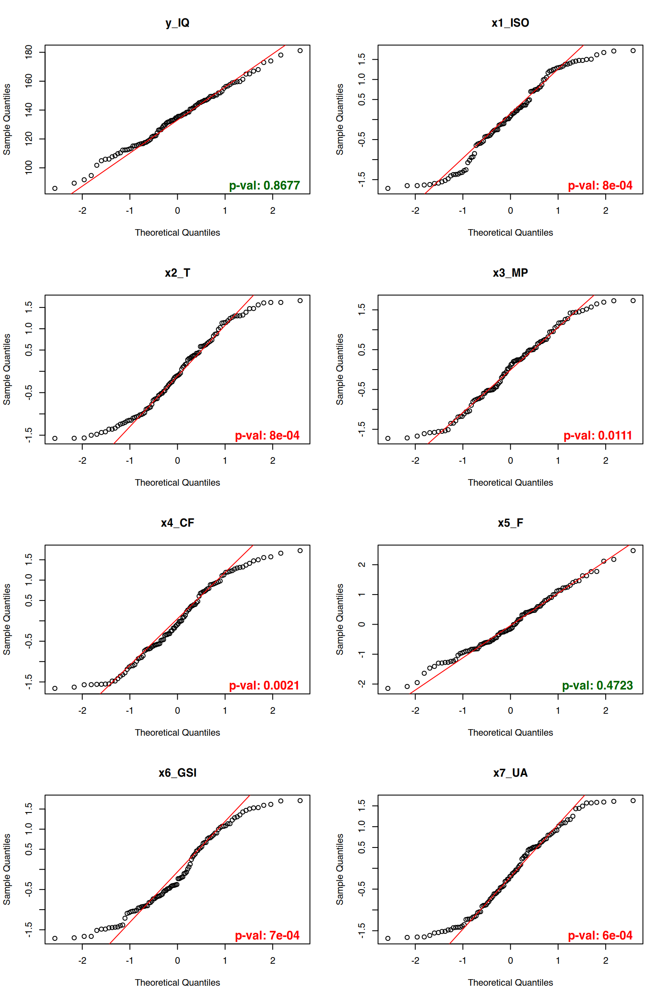

Notiamo che nel caso di y_IQ il p-value è 0.86, ovvero dando per scontato che la popolazione sia perfettamente normale, con l'86% di probabilità c'è la possibilità di ottenere un campione meno conforme alla distribuzione normale.

Dato che il livello di significatività è 0.05, non possiamo rifiutare l'ipotesi nulla, di conseguenza possiamo assumere che i dati provengano da una distribuzione normale.

Ciò accade anche per la variabile x5_F, che come visualizzato sul Q-Q plot segue con buona approssimazione la retta teorica `qqline()`.


## 1.3. Scatter Plot
Un altro strumento utile per visualizzare la relazione tra variabili è lo scatter plot, che rappresenta i dati come punti in un piano cartesiano. Ognuna delle variabili è rappresentata su un asse, limitandosi solitamente a due variabili per grafico.

Per maggiore chiarezza visiva, abbiamo incluso due linee per ogni grafico, una rappresenta la regressione semplice (`lm(b ~ a)`) e l'altra la regressione polinomiale di secondo grado (`lm(b ~ poly(a, 2, raw = TRUE))`). In questa fase, sono utilizzate per meglio dirigere l'attenzione verso eventuali relazioni tra le variabili, che potrebbero altrimenti essere meno evidenti.

Partiamo dalla variabile dipendente y_IQ, confrontandola con le variabili indipendenti.
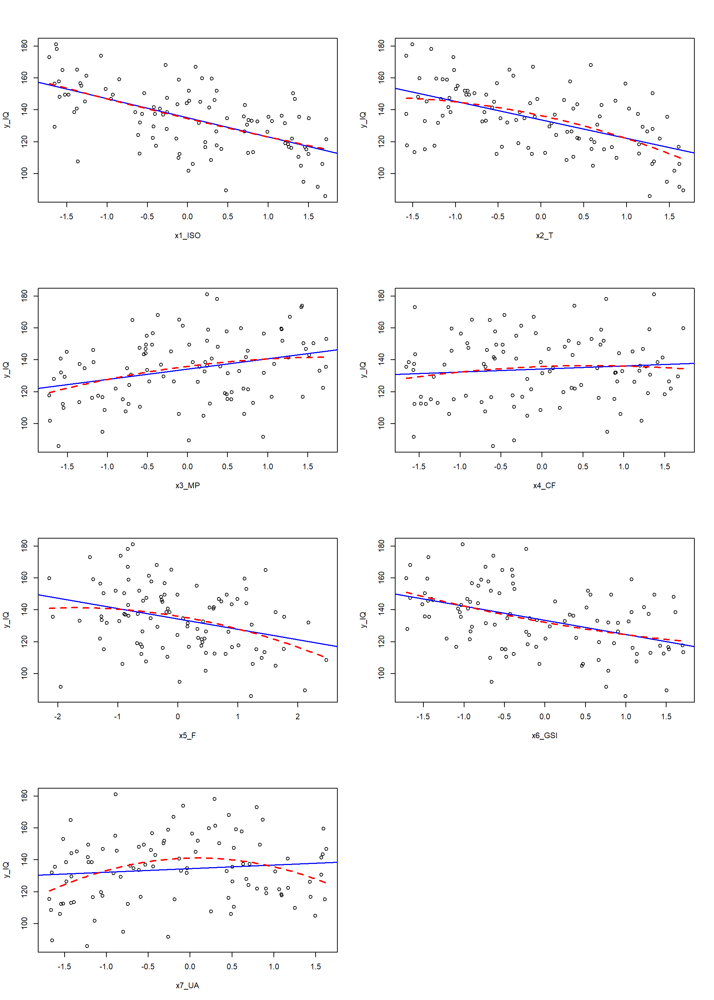

Possiamo già notare che, da un punto di vista lineare, y_IQ sembra essere negativamente correlata con x1_ISO, x2_T, x5_F e x6_GSI. Mostra poi una relazione positiva con x3_MP, e sembrerebbe non avere correlazione, se non molto debole, con x4_CF e x7_UA.

Una particolarità è che x7_UA sembra avere una relazione quadratica molto evidente con y_IQ, che non è invece visibile nella regressione lineare.

Osserviamo ora la relazione tra le variabili indipendenti.

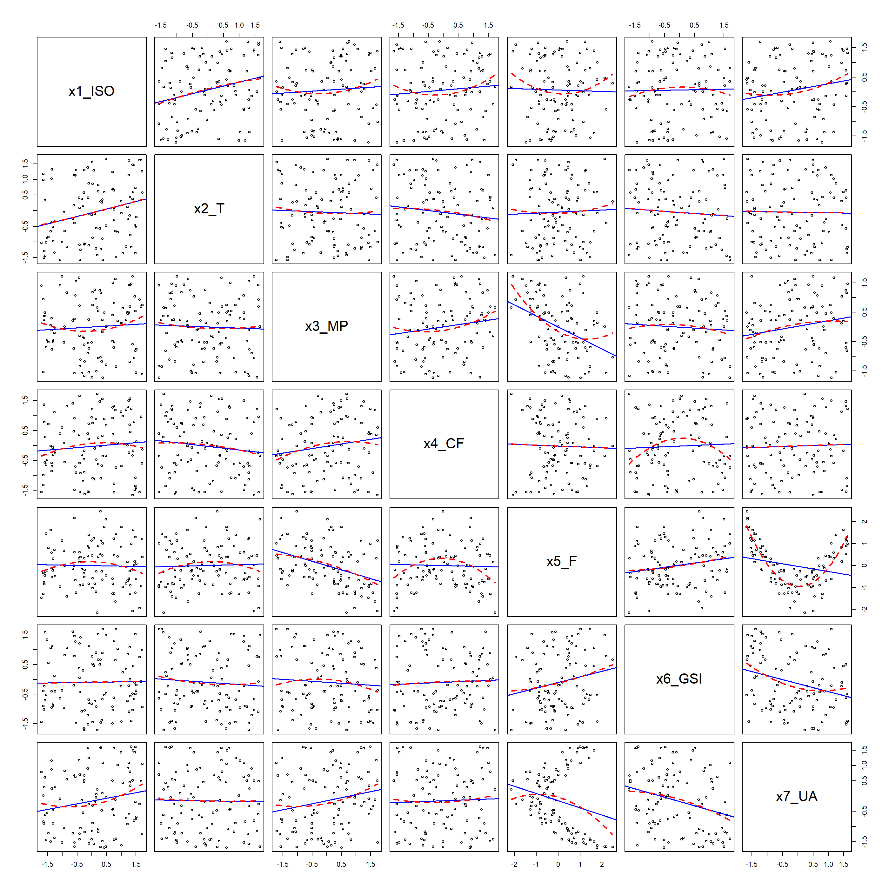

In questo caso, la maggior parte delle variabili non sembra avere correlazioni evidenti. L'eccezione più importante è quella di x5_F e diverse altre variabili. Linearmente, x5_F presenta una forte relazione con x3_MP e, da un punto di vista quadratico, è in relazione con x4_CF, e, in particolare, con x7_UA.

Vorremmo riportare con più enfasi la relazione tra x5_F e x7_UA, che mostra un chiaro caso in cui l'assenza di correlazione non implica l'assenza di relazione tra le variabili. In questo caso, la relazione è chiaramente quadratica.

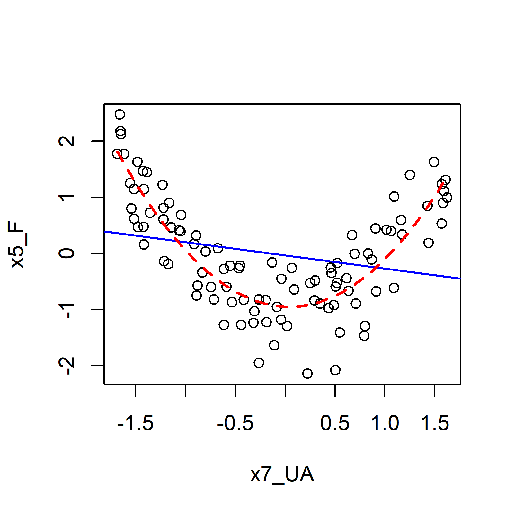{width=40%}


## 1.4. Analisi di Correlazione
Procediamo ora a valutare la correlazione tra le variabili, per ottenere informazioni più precise sulle relazioni tra di esse.
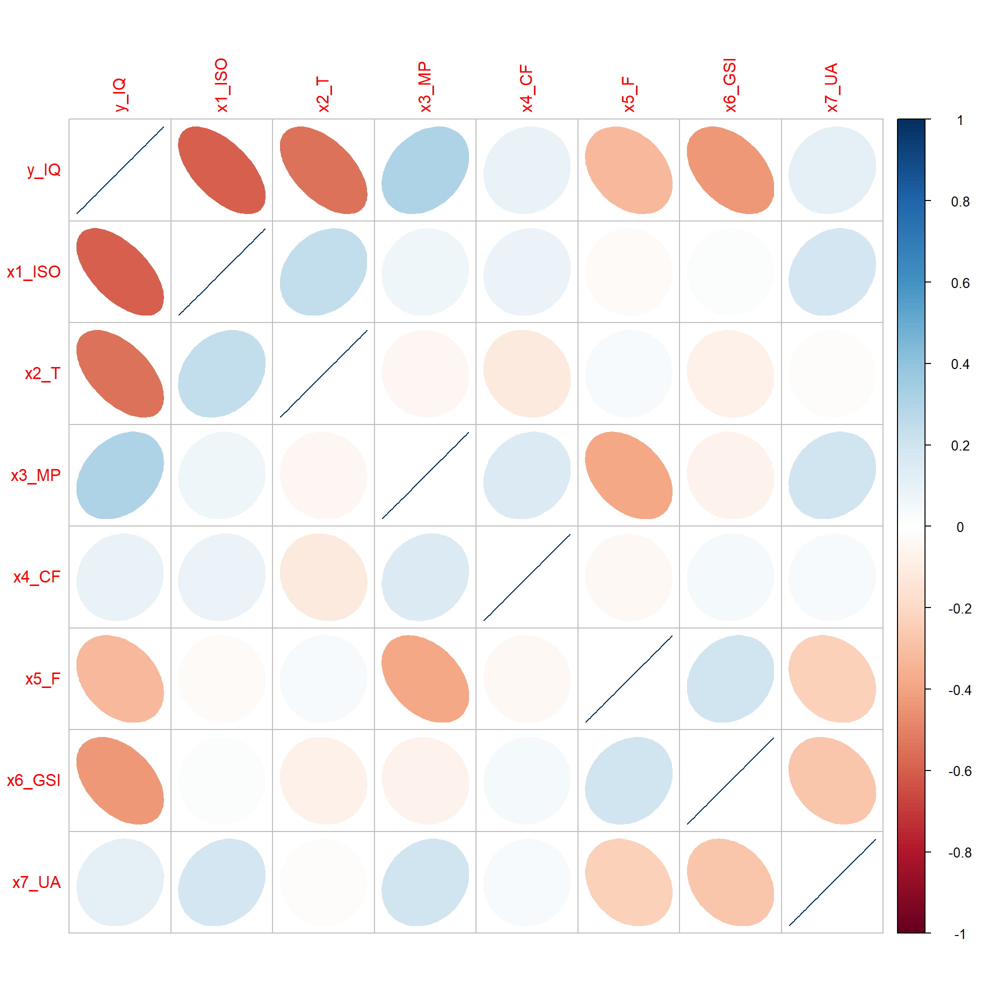{width=80%}

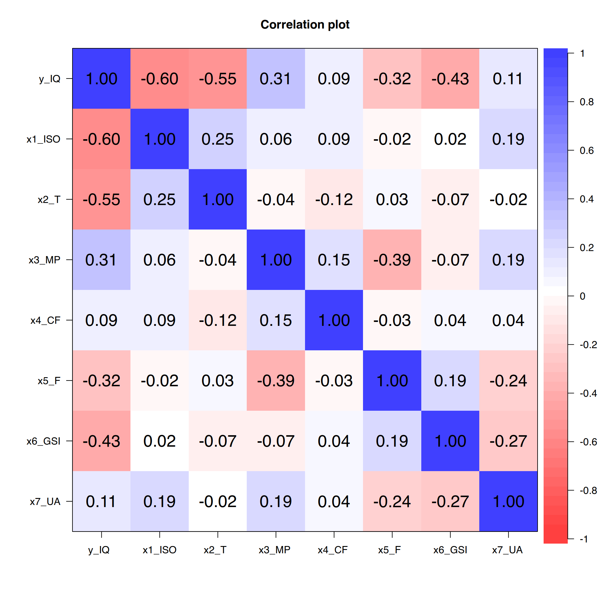{width=80%}

Basandoci sulle indicazioni presentate durante il corso, possiamo interpretare i valori di correlazione secondo la seguente tabella:

| Valore di \|R\|        | Interpretazione             |
| :--------------------- | :-------------------------- |
| \|R\| $\in$ [0.9, 1.0] | Correlazione "molto alta"   |
| \|R\| $\in$ [0.7, 0.9) | Correlazione "alta"         |
| \|R\| $\in$ [0.5, 0.7) | Correlazione "moderata"     |
| \|R\| $\in$ [0.2, 0.5) | Correlazione "bassa"        |
| \|R\| $\in$ [0, 0.2)   | Correlazione "trascurabile" |

Questi grafici sembrano confermare le ipotesi fatte in precedenza. Non ci troviamo in presenza di correlazioni particolarmente forti. Esplorando i legami tra y_IQ e le variabili indipendenti, si può notare che con le variabili x1_ISO e x2_T è presente una moderata correlazione negativa. Anche con x5_F e x6_GSI notiamo una correlazione negativa, ma bassa. Infine, con x3_MP c'è una bassa correlazione positiva. Tutte le altre variabili sono correlate con y_IQ in maniera trascurabile.

Tra le variabili indipendenti, spicca la correlazione negativa tra x5_F e x3_MP, che avevamo già notato in precedenza, e risulta presente anche una correlazione negativa tra x5_F e x7_UA (oltre alla loro relazione polinomiale), e tra x6_GSI e x7_UA, che non erano state menzionate prima.

In ogni caso, le correlazioni tra le variabili indipendenti menzionate sono basse, e tutte le altre risultano essere trascurabili. Ci aspettiamo quindi di vedere pochi termini multipli nella fase finale.


# 2. Regressione
Nella presente sezione utilizzeremo un'altra serie di strumenti per la ricerca di una superficie di risposta, ovvero un modello che approssimi la realtà e ci permetta di stimare i legami tra la grandezza di interesse y_IQ, e le variabili indipendenti, che prendono il nome di regressori.
Nella presente sezione utilizzeremo un'altra serie di strumenti per la ricerca di una superficie di risposta, ovvero un modello che approssimi la realtà e ci permetta di stimare i legami tra la grandezza di interesse y_IQ, e le variabili indipendenti, che prendono il nome di regressori.

Uno degli indici di "bontà" del modello è il coefficiente di determinazione $R^2$:
Uno degli indici di "bontà" del modello è il coefficiente di determinazione $R^2$:
$$
0 \underset{\text{useless}}{\le} R^2 = \frac{SQR}{SQTOT} \underset{\text{ideal}}{\le} 1
0 \underset{\text{useless}}{\le} R^2 = \frac{SQR}{SQTOT} \underset{\text{ideal}}{\le} 1
$$

Esso misura la quota della variabilità totale ($SQTOT$) di y_IQ spiegata dal modello di regressione ($SQR$), dove:
Esso misura la quota della variabilità totale ($SQTOT$) di y_IQ spiegata dal modello di regressione ($SQR$), dove:
$$
\overset{SQTOT}{\sum_{i=1}^{n} (Y_i - \bar{Y})^2} = \overset{SQR}{\sum_{i=1}^{n} (\hat{Y}_i - \bar{Y})^2} + \overset{SQE}{\sum_{i=1}^{n} (Y_i - \hat{Y}_i)^2}
$$

In questa formula, detta *Teorema di decomposizione della devianza*, $Y$ rappresenta i valori osservati di y_IQ, $\hat{Y}$ rappresenta i valori stimati dal modello, e $\bar{Y}$ rappresenta la media dei valori osservati di y_IQ.

In questa formula, detta *Teorema di decomposizione della devianza*, $Y$ rappresenta i valori osservati di y_IQ, $\hat{Y}$ rappresenta i valori stimati dal modello, e $\bar{Y}$ rappresenta la media dei valori osservati di y_IQ.

## 2.1. Analisi di Modelli Lineari
I modelli considerati in questa fase sono definiti da parametri lineari, cioè sono nella forma:
$$
Y = \beta_0 + \beta_1 x_1 + \dots + \beta_p x_p + \varepsilon
$$

Nel nostro caso la stima viene effettuata tramite `lm()`, che applica il metodo dei minimi quadrati. I coefficienti vengono quindi scelti in modo da minimizzare la somma dei quadrati dei residui:
$$
SQE = \sum_{i=1}^{n}(Y_i - \hat{Y}_i)^2
$$

Per ogni modello osserviamo sia il test globale F, che verifica se il modello nel suo complesso spiega una quota significativa della variabilità di y_IQ, sia i test t sui singoli coefficienti.

$$
\begin{array}{rllllll}
\text{Test globale } F && H_0: \beta_1 = \dots = \beta_p = 0 && H_A: \text{almeno un } \beta_j \neq 0 && F = \frac{MSQR}{MSQE} = \displaystyle{\frac{\frac{SQR}{p}}{\frac{SQE}{n-(p+1)}}} \\\\
\text{Test } t \text{ sui coefficienti} && H_0: \beta_j = 0 && H_A: \beta_j \neq 0  && t_j =\displaystyle{\frac{\hat{\beta}_j}{\text{SE}(\hat{\beta}_j)}}
\end{array}
$$

Usiamo come riferimento un livello di significatività $\alpha = 0.05$: un p-value inferiore a tale soglia suggerisce che il contributo del regressore sia statisticamente significativo, a parità degli altri regressori presenti nel modello.

Pr(>|t|) indica il p-value del test t, mentre il p-value del test F è riportato in fondo al summary del modello.

Una prima ipotesi si può fare partendo da un modello che considera come regressori tutte le variabili indipendenti in maniera lineare.

```R console
Residuals:
     Min       1Q   Median       3Q      Max 
-16.4151  -6.0083  -0.0448   5.3063  23.9197 

Coefficients:
             Estimate Std. Error t value Pr(>|t|)    
(Intercept) 133.70383    0.87116 153.478  < 2e-16 ***
x1_ISO      -10.19229    0.88968 -11.456  < 2e-16 ***
x2_T         -9.08574    0.92760  -9.795 6.17e-16 ***
x3_MP         4.83753    0.96164   5.030 2.41e-06 ***
x4_CF         1.31206    0.89342   1.469  0.14536    
x5_F         -2.95490    0.94569  -3.125  0.00238 ** 
x6_GSI       -8.55331    0.90959  -9.403 4.11e-15 ***
x7_UA         0.08169    0.92564   0.088  0.92987    
---
Signif. codes:  0 ‘***’ 0.001 ‘**’ 0.01 ‘*’ 0.05 ‘.’ 0.1 ‘ ’ 1

Residual standard error: 8.442 on 92 degrees of freedom
Multiple R-squared:  0.8408,	Adjusted R-squared:  0.8287 
F-statistic: 69.43 on 7 and 92 DF,  p-value: < 2.2e-16
```
*fit0*

Il modello `fit0` mostra già un ottimo p-value per il test globale F e coefficiente di determinazione $R^2$. Per il test t risultano poco significativi i regressori `x4_CF` e `x7_UA`, che andremo a rimuovere uno per volta nei due fit successivi, `fit1` e `fit2`, per valutare se la loro rimozione comporti un miglioramento del modello. Durante questa operazione notiamo una crescita dell'F-statistic, che suggerisce un miglioramento del modello, ma anche una crescita dell'errore standard residuo ed una lieve decrescita dell'R² dopo la seconda rimozione. 

Una seconda ipotesi consiste nell'aggiungere tutte le interazioni a due a due tra i regressori (`.^2`). In questo modo il modello può descrivere situazioni in cui l'effetto di una variabile su y_IQ dipende dal valore assunto da un'altra variabile.

```R console
Residuals:
    Min      1Q  Median      3Q     Max 
-16.567  -4.634  -0.109   4.933  23.722 

Coefficients:
               Estimate Std. Error t value Pr(>|t|)    
(Intercept)   133.89240    1.18604 112.890  < 2e-16 ***
x1_ISO         -9.53103    1.19481  -7.977 1.84e-11 ***
x2_T          -10.47134    1.28538  -8.146 8.95e-12 ***
x3_MP           3.99934    1.23660   3.234  0.00185 ** 
x4_CF           1.98511    1.29976   1.527  0.13113    
x5_F           -2.49288    1.37656  -1.811  0.07438 .  
x6_GSI         -8.46570    1.12739  -7.509 1.36e-10 ***
x7_UA          -0.04251    1.36524  -0.031  0.97525    
x1_ISO:x2_T     0.35585    1.10511   0.322  0.74840    
x1_ISO:x3_MP   -0.18932    1.33046  -0.142  0.88725    
x1_ISO:x4_CF    0.75621    1.35418   0.558  0.57831    
x1_ISO:x5_F     0.90324    1.32815   0.680  0.49867    
x1_ISO:x6_GSI  -0.33701    1.17166  -0.288  0.77446    
x1_ISO:x7_UA   -1.41419    1.37966  -1.025  0.30883    
x2_T:x3_MP      0.25969    1.27341   0.204  0.83899    
x2_T:x4_CF     -1.79419    1.30295  -1.377  0.17283    
x2_T:x5_F      -1.58614    1.44128  -1.101  0.27483    
x2_T:x6_GSI     0.39205    1.22269   0.321  0.74942    
x2_T:x7_UA      0.76962    1.30911   0.588  0.55847    
x3_MP:x4_CF    -2.29538    1.34869  -1.702  0.09314 .  
x3_MP:x5_F     -0.01491    1.22538  -0.012  0.99033    
x3_MP:x6_GSI    0.48022    1.31550   0.365  0.71616    
x3_MP:x7_UA     0.35363    1.21678   0.291  0.77218    
x4_CF:x5_F     -0.37145    1.07957  -0.344  0.73181    
x4_CF:x6_GSI    1.30071    1.24909   1.041  0.30126    
x4_CF:x7_UA     0.90465    1.18235   0.765  0.44673    
x5_F:x6_GSI     0.11427    1.33602   0.086  0.93208    
x5_F:x7_UA      0.48182    1.31747   0.366  0.71566    
x6_GSI:x7_UA   -0.10088    1.16234  -0.087  0.93108    
---
Signif. codes:  0 ‘***’ 0.001 ‘**’ 0.01 ‘*’ 0.05 ‘.’ 0.1 ‘ ’ 1

Residual standard error: 9.045 on 71 degrees of freedom
Multiple R-squared:  0.859,	Adjusted R-squared:  0.8033 
F-statistic: 15.44 on 28 and 71 DF,  p-value: < 2.2e-16
```
*fit00*

Per `fit00` il valore dell'F-statistic è notevolmente inferiore rispetto ai modelli precedenti, mentre il coefficiente di determinazione $R^2$ cresce marginalmente ($+1.8\%$). Per il test t, quasi tutti i regressori sembrano non essere significativi, e vengono quindi rimossi, mantenendo x3_MP:x4_CF x5_F nonostante il loro p-value relativamente elevato.

Tale rimozione porta x5_F ad assumere una maggiore importanza (p-value da 0.074 a 0.0015), e porta a una notevole crescita dell'F-statistic e ad una marginale riduzione del valore di $R^2$.

Poiché nella fase descrittiva era stata notata una relazione curva legata a `x7_UA`, proviamo allora ad aggiungere al modello con interazioni anche il termine quadratico `I(x7_UA^2)`.

```R console
Residuals:
    Min      1Q  Median      3Q     Max 
-17.123  -4.103  -0.735   4.819  21.942 

Coefficients:
               Estimate Std. Error t value Pr(>|t|)    
(Intercept)   138.76884    2.61758  53.014  < 2e-16 ***
x1_ISO         -9.30974    1.17268  -7.939 2.37e-11 ***
x2_T          -10.38092    1.25712  -8.258 6.12e-12 ***
x3_MP           5.33276    1.36848   3.897 0.000221 ***
x4_CF           2.17470    1.27369   1.707 0.092180 .  
x5_F            1.65265    2.40641   0.687 0.494495    
x6_GSI         -8.60629    1.10402  -7.795 4.35e-11 ***
x7_UA          -0.44428    1.34836  -0.329 0.742765    
I(x7_UA^2)     -5.16944    2.48789  -2.078 0.041393 *  
x1_ISO:x2_T     0.14974    1.08471   0.138 0.890597    
x1_ISO:x3_MP   -0.32495    1.30206  -0.250 0.803655    
x1_ISO:x4_CF    0.56317    1.32687   0.424 0.672547    
x1_ISO:x5_F     0.87202    1.29826   0.672 0.503993    
x1_ISO:x6_GSI  -0.13137    1.14948  -0.114 0.909336    
x1_ISO:x7_UA   -0.78719    1.38187  -0.570 0.570735    
x2_T:x3_MP      0.66589    1.25992   0.529 0.598813    
x2_T:x4_CF     -1.58951    1.27734  -1.244 0.217507    
x2_T:x5_F      -1.52257    1.40908  -1.081 0.283611    
x2_T:x6_GSI     0.73634    1.20652   0.610 0.543639    
x2_T:x7_UA      0.45238    1.28863   0.351 0.726603    
x3_MP:x4_CF    -1.98688    1.32658  -1.498 0.138693    
x3_MP:x5_F     -0.17375    1.20015  -0.145 0.885303    
x3_MP:x6_GSI    0.53562    1.28608   0.416 0.678338    
x3_MP:x7_UA     0.68757    1.20012   0.573 0.568535    
x4_CF:x5_F     -0.20234    1.05834  -0.191 0.848935    
x4_CF:x6_GSI    1.53430    1.22606   1.251 0.214951    
x4_CF:x7_UA     0.98768    1.15635   0.854 0.395945    
x5_F:x6_GSI    -0.09811    1.30985  -0.075 0.940505    
x5_F:x7_UA      0.55041    1.28815   0.427 0.670481    
x6_GSI:x7_UA   -0.79450    1.18412  -0.671 0.504452    
---
Signif. codes:  0 ‘***’ 0.001 ‘**’ 0.01 ‘*’ 0.05 ‘.’ 0.1 ‘ ’ 1

Residual standard error: 8.841 on 70 degrees of freedom
Multiple R-squared:  0.8672,	Adjusted R-squared:  0.8121 
F-statistic: 15.76 on 29 and 70 DF,  p-value: < 2.2e-16
```
*fit000*

Nel modello `fit000` il termine `I(x7_UA^2)` risulta significativo, con p-value pari a 0.041393. Questo conferma che l'effetto di `x7_UA` non viene rappresentato bene da un termine puramente lineare, mentre una componente quadratica cattura parte della relazione osservata graficamente.

L'F-statistic assume un valore simile a quello di `fit00`, mentre $R^2$ cresce ancora una volta marginalmente ($+0.9\%$). Rimuovendo i termini trascurabili, e iterando il processo, otteniamo il modello `fit002` che presenta l'F-statistic più alto tra tutti i modelli considerati, e un $R^2$ comparabile con i precedenti modelli derivati. Notiamo anche che il termine quadratico `I(x7_UA^2)` risulta ancora più significativo, con un p-value che scende di tre ordini di grandezza.

L'ultimo modello esteso riportato aggiunge anche il termine quadratico `I(x2_T^2)`, mantenendo `I(x7_UA^2)` e tutte le interazioni. Questa prova nasce dal fatto che `x2_T` è uno dei regressori più influenti già nel modello lineare e può quindi essere utile verificare se il suo effetto su y_IQ presenti anche una componente curva.

```R console
Residuals:
     Min       1Q   Median       3Q      Max 
-18.6845  -4.0207   0.7614   4.4482  19.3762 

Coefficients:
               Estimate Std. Error t value Pr(>|t|)
(Intercept)   141.87070    2.53680  55.925  < 2e-16 ***
x1_ISO         -9.65770    1.07920  -8.949 3.70e-13 ***
x2_T          -10.19275    1.15376  -8.834 5.97e-13 ***
x3_MP           4.75688    1.26402   3.763 0.000348 ***
x4_CF           1.96591    1.16918   1.681 0.097199 .
x5_F            0.65264    2.22233   0.294 0.769890
x6_GSI         -8.58417    1.01232  -8.480 2.65e-12 ***
x7_UA          -0.06750    1.24036  -0.054 0.956760
I(x2_T^2)      -4.44652    1.17753  -3.776 0.000334 ***
I(x7_UA^2)     -4.83925    2.28288  -2.120 0.037622 *
x1_ISO:x2_T     1.35344    1.04443   1.296 0.199338
x1_ISO:x3_MP   -0.18903    1.19443  -0.158 0.874717
x1_ISO:x4_CF    0.43473    1.21711   0.357 0.722047
x1_ISO:x5_F     1.12258    1.19225   0.942 0.349698
x1_ISO:x6_GSI  -0.11269    1.05399  -0.107 0.915162
x1_ISO:x7_UA   -0.58473    1.26820  -0.461 0.646201
x2_T:x3_MP      0.46159    1.15652   0.399 0.691035
x2_T:x4_CF     -1.91836    1.17446  -1.633 0.106939
x2_T:x5_F      -1.98445    1.29779  -1.529 0.130813
x2_T:x6_GSI     0.56059    1.10727   0.506 0.614272
x2_T:x7_UA     -0.44878    1.20544  -0.372 0.710815
x3_MP:x4_CF    -1.41394    1.22579  -1.153 0.252690
x3_MP:x5_F     -0.64495    1.10750  -0.582 0.562230
x3_MP:x6_GSI   -0.02745    1.18863  -0.023 0.981640
x3_MP:x7_UA     0.19452    1.10813   0.176 0.861172
x4_CF:x5_F     -0.49071    0.97341  -0.504 0.615787
x4_CF:x6_GSI    1.08155    1.13058   0.957 0.342094
x4_CF:x7_UA     0.80578    1.06138   0.759 0.450329
x5_F:x6_GSI     0.11572    1.20237   0.096 0.923607
x5_F:x7_UA      0.46718    1.18134   0.395 0.693722
x6_GSI:x7_UA   -1.27289    1.09312  -1.164 0.248250
---
Signif. codes:  0 '***' 0.001 '**' 0.01 '*' 0.05 '.' 0.1 ' ' 1

Residual standard error: 8.107 on 69 degrees of freedom
Multiple R-squared:  0.8899,    Adjusted R-squared:  0.842
F-statistic: 18.59 on 30 and 69 DF,  p-value: < 2.2e-16
```
*fit0000*

Il modello `fit0000` ottiene l'$R^2$ più alto tra quelli riportati con un valore di 0.8899. Per riguarda l'F-statistic, notiamo un lieve miglioramento rispetto a `fit000`. Sembrerebbe inoltre che il termine quadratico `I(x2_T^2)` sia molto significativo, mentre `I(x7_UA^2)` mantiene un livello simile a quello di `fit000`.

Rimuovendo ancora una volta i termini trascurabili arriviamo al modello `fit0002`:

$$
Y = 141.16 - 9.88 \cdot \text{x1\_ISO} - 9.23 \cdot \text{x2\_T} + 5.96 \cdot \text{x3\_MP} - 8.20 \cdot \text{x6\_GSI} - 3.65 \cdot \text{x2\_T}^2 - 4.09 \cdot \text{x7\_UA}^2 + \varepsilon
$$


```R console
Residuals:
     Min       1Q   Median       3Q      Max 
-19.8304  -4.8654   0.9343   4.7614  20.2500

Coefficients:
            Estimate Std. Error t value Pr(>|t|)
(Intercept) 141.1581     1.5458  91.320  < 2e-16 ***
x1_ISO       -9.8775     0.7902 -12.500  < 2e-16 ***
x2_T         -9.2344     0.8345 -11.066  < 2e-16 ***
x3_MP         5.9568     0.8021   7.426 5.26e-11 ***
x6_GSI       -8.1953     0.8019 -10.220  < 2e-16 ***
I(x2_T^2)    -3.6453     0.9532  -3.824 0.000237 ***
I(x7_UA^2)   -4.0947     0.8811  -4.647 1.11e-05 ***
---
Signif. codes:  0 '***' 0.001 '**' 0.01 '*' 0.05 '.' 0.1 ' ' 1

Residual standard error: 7.687 on 93 degrees of freedom
Multiple R-squared:  0.8666,    Adjusted R-squared:  0.858
F-statistic: 100.7 on 6 and 93 DF,  p-value: < 2.2e-16
```
*fit0002*

Questo modello presenta una F-statistic molto vicina a quella di `fit002`, e uno dei più alti $R^2$ osservati finora.


## 2.2. Confronto modelli per indici
Presentiamo ora un confronto tra tutti i modelli da noi considerati. Abbiamo scelto di confrontare i modelli in base a sei indici: SQE, $R^2$, adjusted $R^2$, F-statistic, AIC e BIC.

L'adjusted $R^2$ è una versione modificata del coefficiente di determinazione $R^2$ che tiene conto del numero di regressori presenti nel modello. Esso penalizza l'aggiunta di regressori che non migliorano significativamente la capacità predittiva del modello, seguendo una logica simile a quella del MSQE Test: non basta ridurre l'errore residuo, bisogna anche valutare se il miglioramento giustifica la perdita di gradi di libertà.

Questo aspetto è collegato al bias-variance tradeoff: aggiungere regressori può ridurre il bias del modello, ma può anche aumentarne la varianza e portare a overfitting, cioè a un modello troppo adattato al campione osservato.

AIC (Akaike Information Criterion) e BIC (Bayesian Information Criterion) sono due criteri di selezione del modello che bilanciano la bontà del fit con la complessità del modello. Entrambi i criteri penalizzano l'aggiunta di regressori. In generale, un modello con un AIC o BIC più basso è preferibile.

$$
\begin{array}{rcl}
\text{AIC} & = & -2\log(L) + 2d
\\
\text{BIC} & = & -2\log(L) + \log(n)d
\end{array}
$$

dove $L$ è verosimiglianza nel massimo, $d$ è il numero di parametri stimati e $n$ è il numero di osservazioni.

```R console
r$> print(confronto_modelli)
             SQE        R2       R2a     Fstat      AIC      BIC
fit0        6556    0.8408    0.8287     69.43    720.1    743.5
fit1        6557    0.8408    0.8306     81.87    718.1    738.9
fit2        6710    0.8371    0.8284     96.60    718.4    736.6
fit00       5809    0.8590    0.8033     15.44    750.0    828.1
fit01       6508    0.8420    0.8318     82.60    717.4    738.2
fit000      5472    0.8672    0.8121     15.76    746.0    826.8
fit001      6229    0.8488    0.8390     87.00    713.0    733.8
fit002      6359    0.8456    0.8374    102.98    713.0    731.3
fit003      6334    0.8462    0.8363     85.30    714.6    735.5
fit0000     4535    0.8899    0.8420     18.59    729.2    812.6
fit0001     5396    0.8690    0.8590     87.18    700.6    724.1
fit0002     5495    0.8666    0.8580    100.69    700.4    721.3
fit0003     5492    0.8667    0.8565     85.43    702.4    725.8
```

Per quanto riguarda l'$R^2$, il modello `fit0000` presenta il valore più alto, ma osservando l'adjusted $R^2$ possiamo vedere come l'elevato numero di regressori penalizzi il modello. Per l'adjusted $R^2$, il modello migliore risulta essere invece `fit0001`, ma `fit0002` possiede praticamente lo stesso valore.

Da un punto di vista di Somma Quadratica degli Errori (SQE), il modello migliore risulta essere senza ombra di dubbio `fit0000`, mentre la maggior parte degli altri si attesta intorno a 5500 o 6500.

Infine, valutando AIC e BIC, i modelli migliori risultano essere `fit0001` e `fit0002`, il cui comportamento rispecchia quello di `fit001` e `fit002`, i quali presentano valori pressocché identici per AIC, e solo marginalmente diversi per BIC, con una prediligenza per i modelli con meno regressori. Questo è facilmente spiegabile dalla struttura estremamente simile tra i 4 modelli.

In questa sezione abbiamo incluso anche i modelli `fit003` e `fit0003`, che introducono nuovamente il regressore x5_F al miglior modello precedente, per valutarne le performance: in generale migliorano marginalmente l'SQE e l'$R^2$ ma tale aggiunta condiziona significativamente gli indici dipendenti dal numero di regressori, ovvero F-statistic, adjusted $R^2$, AIC e BIC.

Da questa analisi concludiamo che il modello `fit0002` ha il miglior tradeoff tra bontà del modello e numero di regressori usati. Risulta essere sempre tra i migliori per tutti gli indici considerati, ed è il modello più performante in termini di AIC e BIC, che sono gli indici più importanti per la selezione del modello.


## 2.3. Diagnostica  

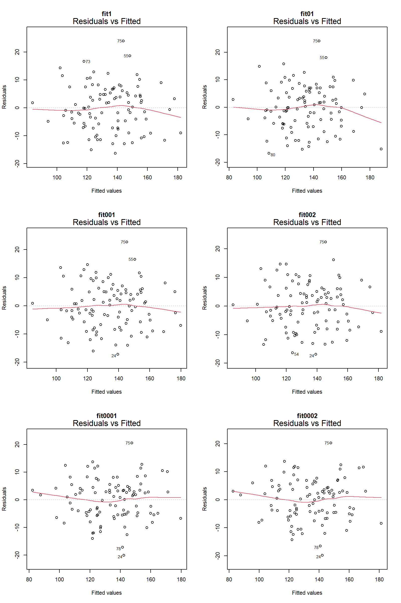

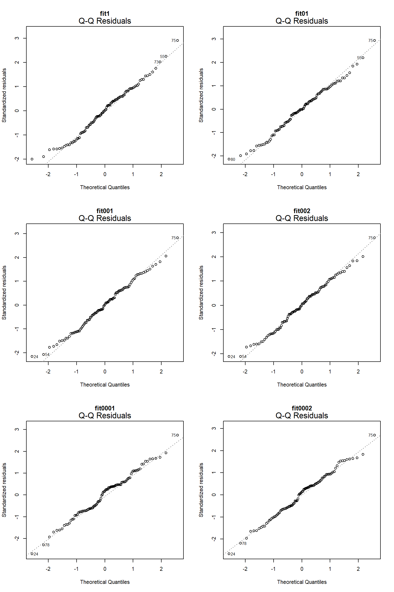

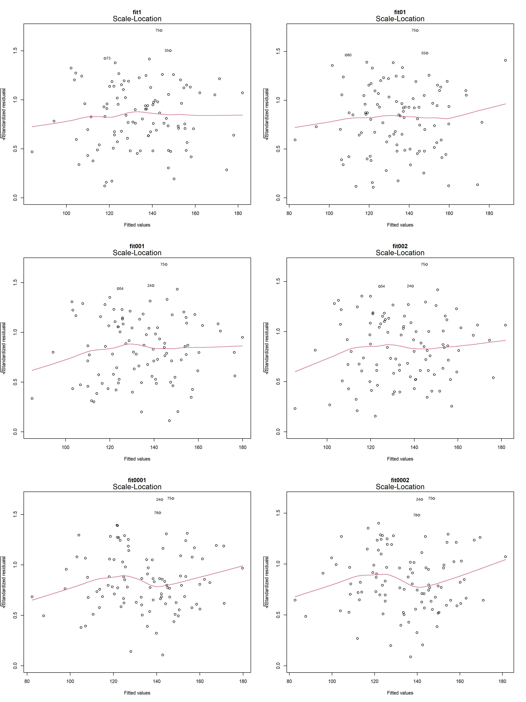

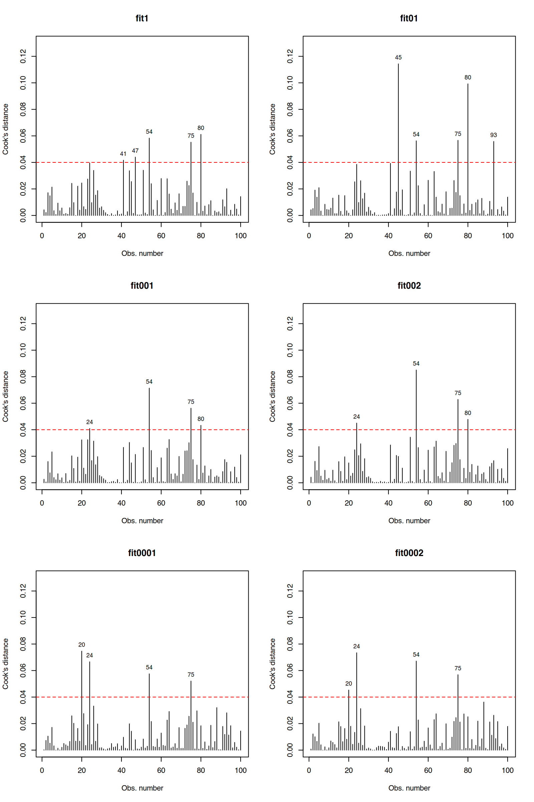

In maniera occhiometrica, il più carino per ogni categoria diagnostica
- Residuals vs Fitted -> fit002 (Runner up: fit0002)
- Q-Q Plots: fit0002 (Runner up: fit0001)
- Scale-Location: fit1 (Runner up: fit01)
- Cook's Distance: fit001 (Runner up: fit1)


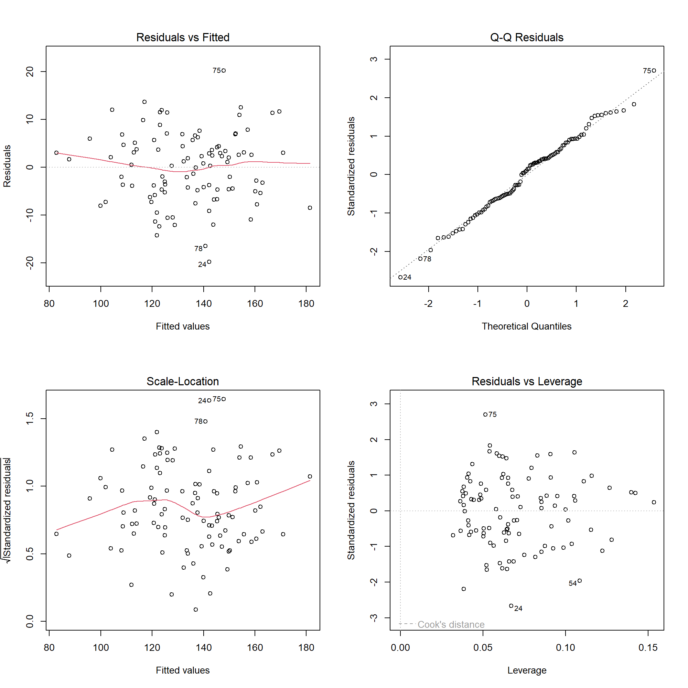


È possibile effettuare un'ulteriore analisi diagnostica su quanto i regressori siano correlati tra loro, ovvero la multicollinearità del modello scelto (`vif(FLAG)`). 

Per calcolare il VIF di ciascun regressore lo isoliamo come variabile dipendente, e ne prevediamo poi il valore tramite regressione lineare semplice, in funzione di tutti gli altri; questo valore indica quindi quanto quel singolo regressore sia spiegato dalle rimanenti variabili.

$$
1 \underset{\text{best}}< VIF_j = \frac{1}{1-R_j^2}
$$

```R console
    x1_ISO       x2_T      x3_MP     x6_GSI  I(x2_T^2) I(x7_UA^2) 
  1.079947   1.079358   1.024063   1.051543   1.021741   1.066195 
```
*Multicollinearità di FLAG*

Come si può notare, il modello FLAG non mostra segni di collinearità tra più variabili.
Abbiamo trovato interessante mostrare un caso in cui i parametri del modello presentano un VIF non trascurabile. `vif(fit0000)` restituisce ad esempio:

```R console
        x5_F    I(x7_UA^2)
    7.439663      6.433935
```
*Estratto dei VIF>5*

Il valore del VIF di x5_F si allinea con i risultati dell'[analisi di correlazione](#14-analisi-di-correlazione), in cui vediamo chiaramente come x5_F sia correlato con diverse altre variabili.
<!-- Inaspettato -->


## 2.4. Regressione Stepwise
BIC 


- lm (so fitting)
- residuals
- test di HP 
    - globali
    - individuali
- Mettere poi in latex i modelli con i parametri trovati a numero


## 2.5. Intervalli di Confidenza
Determinazione degli intervalli di confidenza sui parametri trovati: al 95% ogni parametro è tra minimo e massimo dell'intervallo

# 7. Conclusioni Finali
the journey matters more than the destination
- discutere le variabili come se fossero cose vere
